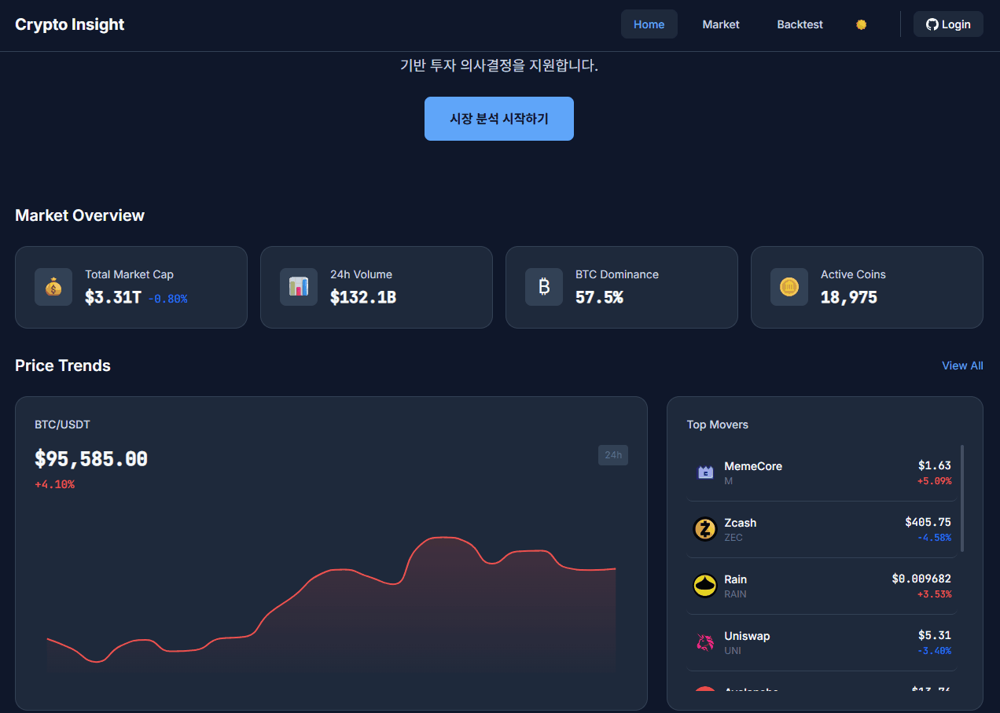
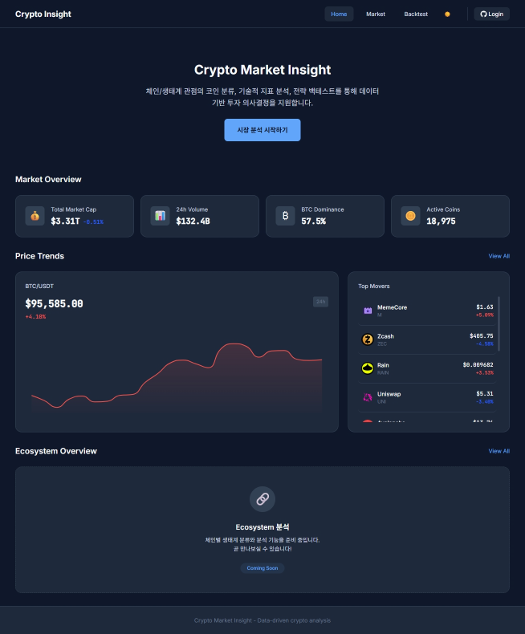
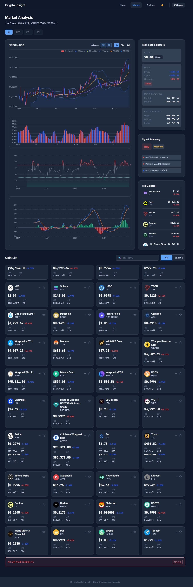
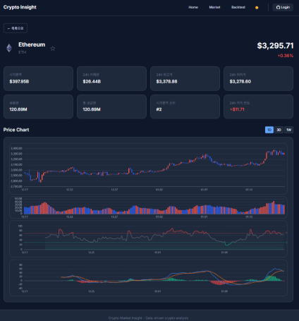
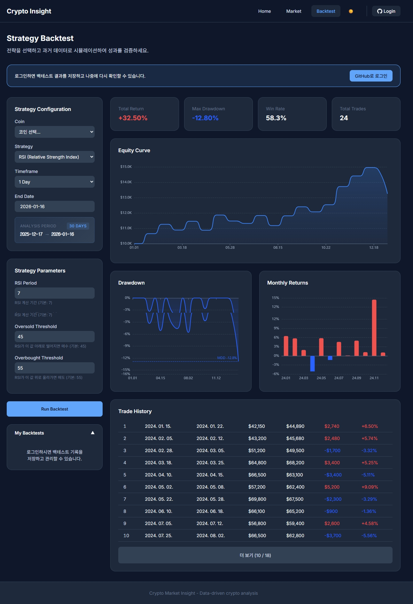

# Crypto Market Insight

[](https://github.com/nickkies/crypto-market-insight/actions/workflows/frontend-ci.yml)
[](https://github.com/nickkies/crypto-market-insight/actions/workflows/backend-ci.yml)
[](LICENSE)

> 가상자산 시장 분석 및 전략 백테스트 플랫폼

## Demo



## Live

| Service     | URL                                                                              |
| ----------- | -------------------------------------------------------------------------------- |
| Frontend    | [crypto-market-insight.vercel.app](https://crypto-market-insight.vercel.app)     |
| Backend API | [crypto-market-insight.onrender.com](https://crypto-market-insight.onrender.com) |
| API Docs    | [Swagger UI](https://crypto-market-insight.onrender.com/swagger-ui/index.html)   |

---

## 프로젝트 소개

Crypto Market Insight는 가상자산 시장 데이터를 기반으로
체인/생태계 관점의 코인 분류, 기술적 지표 분석,
그리고 전략 백테스트를 제공하는 데이터 분석 웹 서비스입니다.

### 해결하려는 문제

- 가격 및 기본 지표 위주의 단편적인 정보 제공
- 전략의 성과를 검증하기 위한 백테스트 환경 부재
- 사용자가 직접 데이터를 수집·가공해야 하는 높은 진입 장벽

`데이터 수집 → 분석 → 전략 검증 → 의사결정`으로 이어지는 흐름을 하나의 서비스로 통합합니다.

---

## Features

### Home

Top Movers(급등/급락 코인) 및 시장 개요 대시보드



### Market Analysis

실시간 OHLCV 차트와 MA, RSI, MACD, Bollinger Bands 등 기술적 지표 분석 및 매매 시그널 제공



### Coin Detail

코인별 상세 정보 및 가격 추이 확인



### Strategy Backtest

과거 데이터 기반 전략 시뮬레이션 - 누적 수익률, MDD, 승률 분석

- 익명 사용자: 백테스트 실행 및 결과 즉시 확인 (저장 불가)
- 로그인 사용자: 백테스트 결과 DB 저장, 목록 조회 및 삭제 가능



---

## Architecture

시계열 데이터 특성과 비용 효율성을 고려한 설계:

- 시세 및 캔들 데이터는 외부 API를 통해 요청 시 조회
- 원본 시계열 데이터는 장기 저장하지 않음
- 서버 캐싱(Caffeine)을 통해 반복 요청 비용 최소화
- 데이터베이스에는 사용자 및 전략 관련 데이터만 저장

---

## Tech Stack

### Frontend

| Category | Technologies                        |
| -------- | ----------------------------------- |
| Core     | React, TypeScript, Vite             |
| State    | TanStack Query, Zustand             |
| UI       | ECharts, Styled Components          |
| Test     | Vitest, Testing Library, Playwright |

### Backend

| Category | Technologies                   |
| -------- | ------------------------------ |
| Core     | Spring Boot 3, Java 21         |
| Security | Spring Security, OAuth2, JWT   |
| Data     | JPA, QueryDSL, PostgreSQL      |
| Cache    | Caffeine                       |
| Test     | JUnit 5, Spring Boot Test      |

### Infrastructure

| Category     | Technologies          |
| ------------ | --------------------- |
| Frontend     | Vercel                |
| Backend      | Render                |
| Database     | Supabase (PostgreSQL) |
| CI/CD        | GitHub Actions        |
| External API | CoinGecko             |

---

## Documentation

상세 문서는 각 디렉토리 README를 참고하세요.

| 문서                                  | 설명                            |
| ------------------------------------- | ------------------------------- |
| [Frontend README](frontend/README.md) | 프론트엔드 구조 및 설계         |
| [Backend README](backend/README.md)   | 백엔드 구조 및 API 설계         |
| [BACKTEST_SPEC.md](BACKTEST_SPEC.md)  | 백테스트 규칙 및 성과 지표 정의 |

---

## Getting Started

### Prerequisites

- Node.js 20+
- Java 21+
- Docker & Docker Compose

### Quick Start (Recommended)

```bash
# 1. Clone
git clone https://github.com/nickkies/crypto-market-insight.git
cd crypto-market-insight

# 2. Environment setup
cp backend/.env.example backend/.env
cp frontend/.env.example frontend/.env

# 3. Start database
docker-compose up -d

# 4. Run backend
cd backend && ./gradlew bootRun

# 5. Run frontend (new terminal)
cd frontend && npm i && npm run dev
```

### Docker Full Stack

```bash
# Development (with hot reload)
docker-compose -f docker-compose.dev.yml up -d

# Production
docker-compose -f docker-compose.prod.yml up -d
```

---

## Project Structure

```text
crypto-market-insight/
├── frontend/               # React SPA
├── backend/                # Spring Boot API
├── docs/                   # Documentation & screenshots
├── BACKTEST_SPEC.md        # 백테스트 스펙 문서
├── docker-compose.yml      # Database only
├── docker-compose.dev.yml  # Full stack (dev)
└── docker-compose.prod.yml # Full stack (prod)
```

---

## API Rate Limit

| User Type     | Limit   | Window |
| ------------- | ------- | ------ |
| Anonymous     | 5 req   | 1 min  |
| Authenticated | 10 req  | 1 min  |
| System Total  | 100 req | 1 min  |

Rate Limit 초과 시 `429 Too Many Requests` 응답과 함께 `Retry-After` 헤더 제공

---

## Branch Strategy (GitHub Flow)

```text
main ─────────────────────────────────────────────►
       \                     /
        └── feature/xxx ────┘
```

| 브랜치      | 용도                            |
| ----------- | ------------------------------- |
| `main`      | 배포 가능한 상태 유지           |
| `feature/*` | 기능 개발 (`feature/add-login`) |
| `fix/*`     | 버그 수정 (`fix/chart-render`)  |

---

## License

This project is licensed under the MIT License - see the [LICENSE](LICENSE) file for details.

---

## Disclaimer

본 프로젝트는 학습 및 포트폴리오 목적으로 제작되었습니다.
제공되는 모든 분석 및 예측 결과는 투자 자문이 아닙니다.
